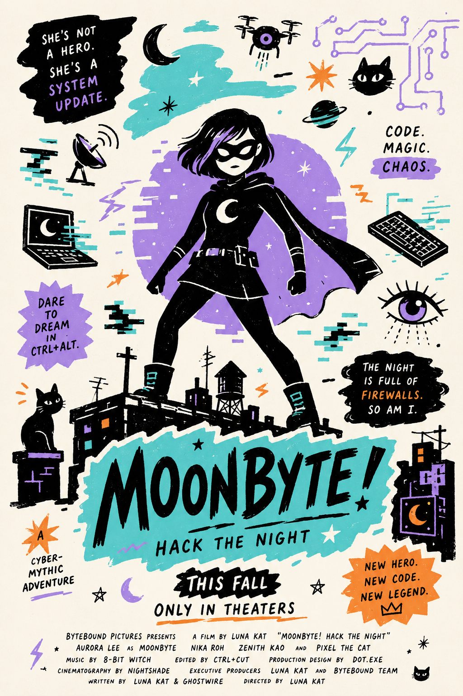
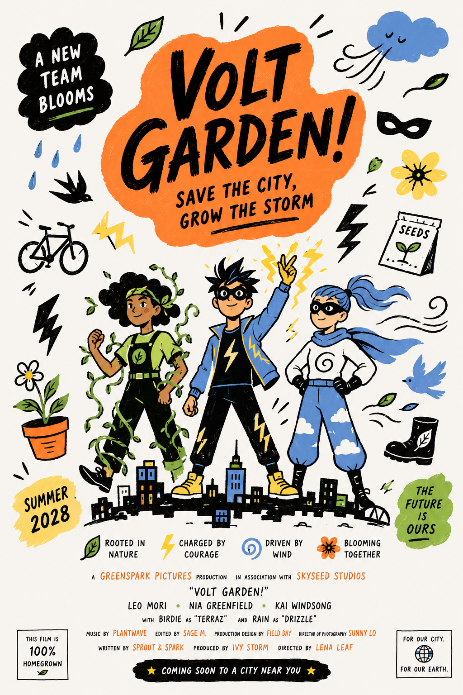
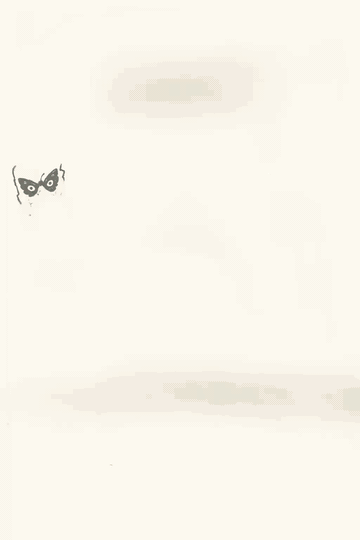
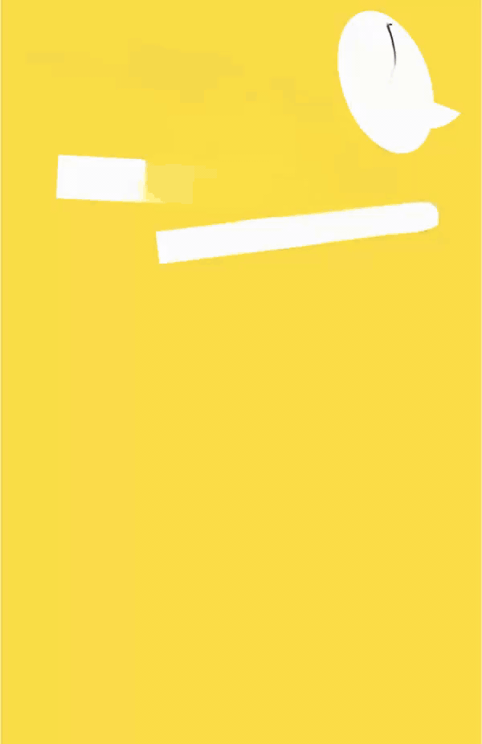
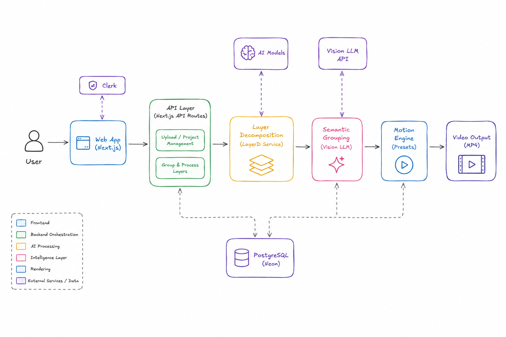

# Fluexy LayerD

Turn a flat raster design into a layered motion video. Fluexy LayerD combines local image decomposition, vision-based semantic grouping, deterministic Remotion presets, and in-browser MP4 rendering.

```text
PNG, JPEG, or WebP → LayerD → semantic groups → animated SVG → H.264 MP4
```

[Demo](#demo) • [Features](#features) • [How it works](#how-it-works) • [Architecture](#architecture) • [Getting started](#getting-started) • [Usage](#usage) • [Design decisions](#design-decisions-and-trade-offs)

## Demo

[Watch the product walkthrough on YouTube](https://youtu.be/NqWstJf0-ek).

The walkthrough covers the product rationale, end-to-end workflow, relevant code, runtime logs, and persisted Neon records.

### Example outputs

The animated previews play directly on GitHub. Select one to open the full MP4.

[Input designs](demo/input/) • [Output previews](apps/web/public/output/) • [MP4 files](demo/output/)

<table>
  <tr>
    <th width="50%">Input</th>
    <th width="50%">Output</th>
  </tr>
  <tr>
    <td width="50%"></td>
    <td width="50%"><a href="demo/output/3.mp4"></a></td>
  </tr>
  <tr>
    <td width="50%"></td>
    <td width="50%"><a href="demo/output/4.mp4"></a></td>
  </tr>
  <tr>
    <td width="50%"></td>
    <td width="50%"><a href="demo/output/5.mp4"></a></td>
  </tr>
  <tr>
    <td width="50%"></td>
    <td width="50%"><a href="demo/output/1.mp4"></a></td>
  </tr>
  <tr>
    <td width="50%"></td>
    <td width="50%"><a href="demo/output/2.mp4"></a></td>
  </tr>
</table>

## Features

- Reconstructs a flat image as independently positioned SVG image layers with [LayerD](https://github.com/CyberAgentAILab/LayerD).
- Uses a vision model to group related text, illustrations, decorations, products, logos, and calls to action into semantic units.
- Provides ten deterministic motion presets with immediate [Remotion](https://www.remotion.dev/) previews.
- Renders a five-second, 30 fps H.264 MP4 entirely in a compatible browser.
- Saves self-contained SVG projects to Neon for authenticated users to reopen, reanimate, or delete.
- Keeps rendered videos local to the browser as temporary object URLs.

## How it works

Fluexy LayerD is inspired by [MG-Gen](https://arxiv.org/abs/2504.02361) and its central idea of controlling video motion through explicit, editable structure. Instead of running the paper's large original model, LayerD recovers movable visual elements from a flat design, a vision-model workflow organizes them into semantic units, and Remotion applies reproducible motion controls before rendering the result as video.

| Component | Role |
| --- | --- |
| LayerD, BiRefNet, and LaMa | Decompose the uploaded image into positioned transparent layers |
| Vision-model workflow | Interpret the source, contact sheet, and layer geometry, then produce a validated semantic grouping plan |
| Remotion | Preview ten selectable motion presets and render a five-second H.264 MP4 |
| Next.js | Provide the studio, API proxy, project history, and rendering interface |
| Neon Postgres and Drizzle | Store each user's self-contained layered SVG projects |
| Clerk | Protect conversion and project APIs and scope projects to the signed-in user |
| Quality controls | Enforce complete layer allocation, background isolation, and deterministic final-frame reconstruction |

> [!NOTE]
> Fluexy LayerD starts from a user-supplied design. Its scope is the motion-control pipeline: converting a flat visual into editable semantic layers and producing a controlled animation from them.

## Architecture



The project separates expensive image understanding from predictable animation execution:

1. The authenticated Next.js route forwards the uploaded image to the local FastAPI service.
2. LayerD decomposes it into transparent raster fragments with positions and dimensions.
3. A vision model sees the source image, a numbered layer contact sheet, and layer geometry, then returns a validated semantic grouping plan.
4. The plan is embedded in the layered SVG as metadata and the self-contained SVG is saved to Neon.
5. Remotion animates each semantic group with a selected preset and renders the final MP4 through WebCodecs.

```text
Browser
  └─ Next.js + Clerk
       ├─ FastAPI + LayerD          layer extraction
       ├─ OpenAI-compatible model  semantic grouping
       ├─ Neon + Drizzle           SVG project history
       └─ Remotion + WebCodecs     preview and MP4 render
```

The direct FastAPI response is ungrouped JSON containing the LayerD SVG, canvas size, and transparent layer images. Semantic grouping happens in the authenticated Next.js `/api/convert` route.

## Prerequisites

- Node.js and npm
- Python 3.11 or 3.12
- [uv](https://docs.astral.sh/uv/)
- Clerk and Neon projects
- An OpenAI-compatible vision model endpoint with structured output support
- A browser with WebCodecs and H.264 encoding support

> [!NOTE]
> The first API startup downloads the LayerD BiRefNet and LaMa model weights and can take several minutes.

## Getting started

Install the JavaScript and Python dependencies from the repository root:

```bash
npm install
uv sync --project apps/api
```

Create `apps/web/.env`:

```dotenv
NEXT_PUBLIC_CLERK_PUBLISHABLE_KEY=...
CLERK_SECRET_KEY=...
DATABASE_URL=...

OPENAI_API_KEY=...
OPENAI_BASE_URL=https://your-openai-compatible-endpoint/v1
OPENAI_MODEL=your-vision-model

# Optional local API overrides
LAYERD_API_URL=http://127.0.0.1:8000
LAYERD_API_KEY=local-layerd-key
```

Create the database table:

```bash
npm run db:push
```

Start the API and web app in separate terminals:

```bash
npm run dev:api
npm run dev:web
```

Open [http://localhost:3001](http://localhost:3001). FastAPI runs at [http://127.0.0.1:8000](http://127.0.0.1:8000), with interactive API documentation at [http://127.0.0.1:8000/docs](http://127.0.0.1:8000/docs).

> [!IMPORTANT]
> `LAYERD_API_KEY` is shared by Next.js and FastAPI. If you change it in `apps/web/.env`, start the API with the same value: `LAYERD_API_KEY=replace-me npm run dev:api`.

## Usage

1. Sign in and drop a PNG, JPEG, or WebP image into the studio.
2. Select one of the ten motion presets.
3. Choose **Extract and group** to run LayerD, create semantic groups, and save the SVG project.
4. Preview the animation and switch presets without repeating extraction.
5. Choose **Render MP4** to render and preview the video in the browser.

Open **History** to revisit or delete saved SVG projects. Reopening a project does not rerun LayerD or the vision model. Rendered MP4s are not persisted.

H.264 requires even dimensions, so odd source dimensions are rounded down by at most one pixel for export.

## API

Call LayerD directly by sending an image in the `image` multipart field:

```bash
curl -X POST http://127.0.0.1:8000/convert \
  -H 'X-API-Key: local-layerd-key' \
  -F image=@apps/web/public/image.png \
  --output layers.json
```

The response has this shape:

```json
{
  "svg": "<svg>...</svg>",
  "canvas_size": [1080, 1080],
  "elements": [
    {
      "id": 0,
      "type": "image",
      "box": {
        "x_min": 0,
        "y_min": 0,
        "x_max": 1080,
        "y_max": 1080
      },
      "image": "data:image/png;base64,..."
    }
  ]
}
```

## Design decisions and trade-offs

### Semantic planning, deterministic execution

A flat bitmap has pixels but no concepts such as “headline,” “background,” or “CTA.” LayerD restores manipulable fragments, and the vision model supplies the missing semantic grouping. Its output is constrained to known roles, exactly one group per layer, and a separate full-canvas background.

Animation remains a pure frame-based function:

```text
visual state = f(group, preset, frame, canvas size)
```

This hybrid keeps the model where visual judgment is useful and keeps transforms, timing, and final-frame reconstruction reproducible. Arbitrary generated animation code would offer more variety, but validated presets are safer, easier to inspect and test, and guaranteed to settle on the reconstructed artwork. A model-based render evaluator is intentionally omitted because deterministic invariants can check the render path without adding another variable, latency-heavy step.

### Self-contained SVG persistence

Each saved SVG embeds its transparent layer images and semantic group metadata. That makes a project portable and lets users reopen it without rerunning either ML stage. The cost is a larger database record and duplicated raster data; the project API therefore rejects SVGs over 20 MB.

### Browser-side rendering

Rendering through WebCodecs avoids a render server and keeps MP4 data on the user's device. The trade-off is browser and hardware dependence: H.264 encoding must be available, large compositions consume client resources, and completed videos disappear when their temporary browser URL is released.

### Persistent model worker

FastAPI loads the LayerD pipeline once during application startup and reuses it across requests. This avoids paying model initialization cost for every conversion, but the API has a slow first start and retains the model's memory footprint while running.

## Project structure

```text
apps/
├── api/        FastAPI wrapper around the LayerD pipeline
└── web/        Authenticated Next.js studio, grouping route, and renderer
packages/
├── config/     Shared TypeScript configuration
├── db/         Drizzle schema and Neon client
├── env/        Server and browser environment validation
└── ui/         Shared UI components and styles
```

## Useful commands

| Command | Description |
| --- | --- |
| `npm run dev:api` | Start FastAPI on port 8000 |
| `npm run dev:web` | Start Next.js on port 3001 |
| `npm run dev` | Start npm workspace development scripts (currently the web app) |
| `npm run db:push` | Push the current Drizzle schema to Neon |
| `npm run db:studio` | Open Drizzle Studio |
| `npm run build` | Build workspaces that define a build script |
| `npm run check-types` | Type-check workspaces that define a type-check script |

## Troubleshooting

### LayerD fails on Apple silicon

The API selects MPS when available. If PyTorch reports an unsupported MPS operation, run LayerD on CPU:

```bash
LAYERD_DEVICE=cpu npm run dev:api
```

### The browser cannot render the MP4

Use a browser with WebCodecs and H.264 encoding support. The studio checks compatibility before rendering and displays the browser-reported issues.

### Next.js cannot reach FastAPI

Confirm FastAPI is running at the `LAYERD_API_URL` value and that both services use the same `LAYERD_API_KEY`. The browser talks only to the authenticated Next.js proxy; it does not call FastAPI directly.
